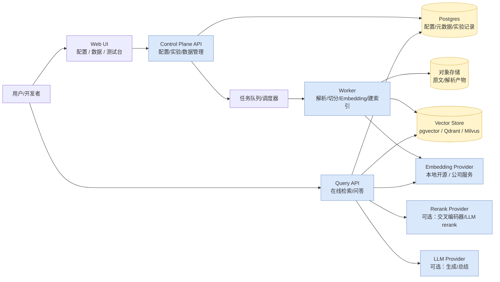
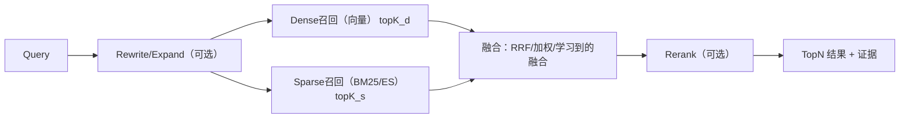
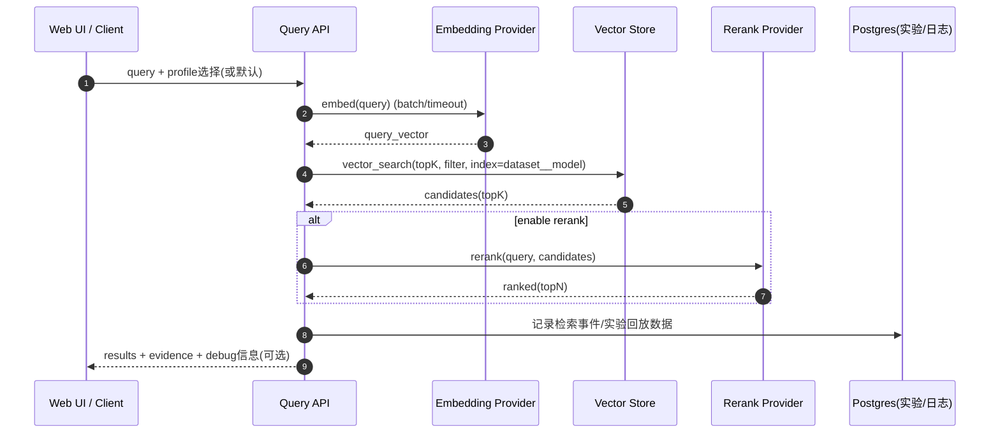
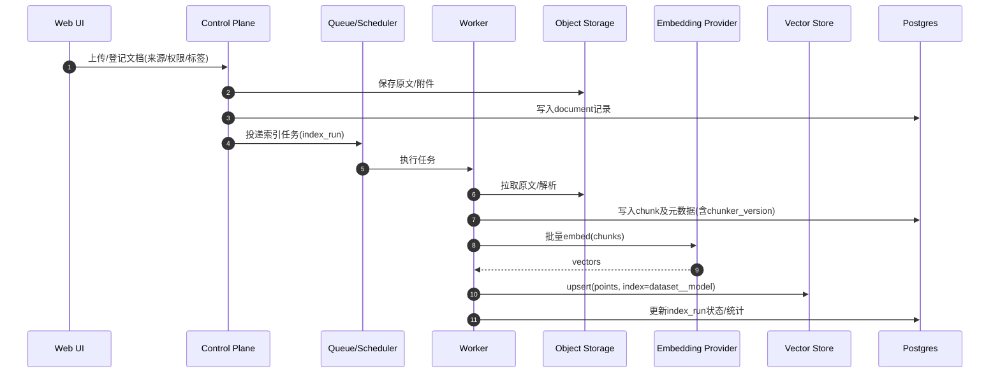
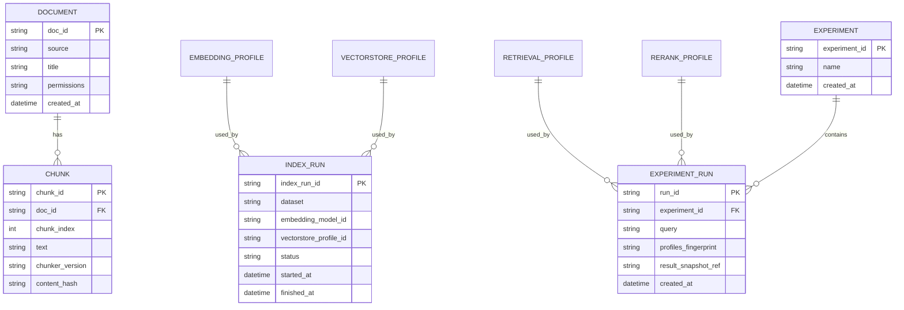

### SimpleRAG 架构设计

本项目目标是构建一个**增强检索召回系统（RAG）**，同时提供：

- **在线 API**：面向业务/应用的检索与问答接口
- **Web 控制面**：可视化配置、数据查看、召回测试、实验对比与回放
- **离线/后台任务**：文档导入、解析、切分、Embedding、索引构建与增量更新
- **可插拔能力**：优雅支持**多种 Embedding**（本地开源/公司服务）与**多种向量库**（pgvector/Qdrant/Milvus…）

---

### 1. 设计原则

- **可配置、可回放、可对比**：任何一次“召回测试/线上查询”都能明确对应一组 profile（配置版本），结果可复现。
- **解耦重活**：在线请求路径尽量 I/O 化；Embedding/Rerank/索引构建等 CPU/GPU 重活服务化或异步化。
- **最小公共能力 + 能力显式降级**：不同向量库能力差异要显式建模，UI/策略层要可降级，而不是“写死某个库”。
- **索引隔离**：不同 `embedding_model_id`（维度/度量/归一化不同）必须隔离 collection/table，避免不可用或效果漂移。

---

### 2. 总体架构（组件图）



---

### 3. 核心概念与 Profiles（配置路由）

系统通过“Profile”实现环境切换与能力解耦：

- **EmbeddingProfile**：选择本地开源模型或公司 embedding 服务（必须支持 batch、超时、重试、限流）
- **VectorStoreProfile**：选择 pgvector / Qdrant / Milvus 等，并配置连接与索引参数
- **RetrievalProfile**：召回策略（dense/sparse/hybrid）、topK、过滤字段、融合策略、阈值等
- **RerankProfile（可选）**：重排模型/服务、topN、超时与降级策略

建议 profiles 以配置文件 + 数据库版本化管理，Web UI 编辑时生成新版本，支持回滚与 A/B 对比。

示例（YAML 思路）：

```yaml
embeddings:
  active: dev_local
  profiles:
    dev_local:
      provider: local_hf
      model: BAAI/bge-m3
      normalize: true
      batch_size: 16
    corp_service:
      provider: remote_openai_compatible
      base_url: ${EMBEDDINGS_BASE_URL}
      api_key: ${EMBEDDINGS_API_KEY}
      model: corp-embedding-v1
      normalize: true
      timeout_s: 10
      batch_size: 128

vector_stores:
  active: local_pgvector
  profiles:
    local_pgvector:
      provider: pgvector
      dsn: ${PG_DSN}
      default_metric: cosine
    local_qdrant:
      provider: qdrant
      url: http://localhost:6333
      api_key: ${QDRANT_API_KEY}
      default_metric: cosine

retrieval:
  active: hybrid_default
  profiles:
    hybrid_default:
      strategy: hybrid            # dense / sparse / hybrid
      dense_topk: 200
      sparse_topk: 200
      fusion: rrf                 # rrf / weighted
      rrf_k: 60
      topn: 20

rerank:
  active: local_dev
  profiles:
    local_dev:
      provider: local_cross_encoder
      model: BAAI/bge-reranker-base
      batch_size: 8
      timeout_s: 5
      max_input_chars: 600
    corp_service:
      provider: remote
      url: ${RERANK_URL}
      api_key: ${RERANK_API_KEY}
      timeout_ms: 800
      batch_size: 64
      on_timeout: fallback_to_unreranked
```

---

### 4. 多 Embedding 设计建议

#### 4.1 开源模型选择（建议优先做对照评测）

- **BGE 系列（BAAI）**：中文/中英混合常用，整体稳（如 `bge-m3`、`bge-*-zh`）
- **GTE 系列（Alibaba-NLP）**：中文与中英混合也常见（按算力与评测结果选型）
- **E5 系列（intfloat）**：检索基准长期稳定（中文效果需用你的语料实测）

> 生产上线前以对应模型卡 license 为准。

#### 4.2 抽象接口（统一本地与远端）

- 统一 `Embedder` 接口：`embed(texts[]) -> vectors[]`（强制 batch）
- 元数据写入：`embedding_model_id`、`dim`、`normalize`、`embedding_version`
- 本地实现：HF/sentence-transformers；公司环境：HTTP/gRPC（建议做成 OpenAI embeddings 兼容协议，切换只改配置）

---

### 5. 多向量库设计建议

#### 5.1 抽象接口（业务层不感知具体库）

建议定义最小公共接口：

- `upsert(points)`：批量写入（向量 + payload/元数据引用）
- `delete(ids|filter)`
- `query(vector, top_k, filter, include_payload)`
- `ensure_index(index_spec)`（可选）

并通过 capability 显式标识差异（过滤、稀疏向量、混合检索等），在策略层做**可控降级**。

#### 5.2 索引隔离与命名

不同 embedding 维度/度量不可混用，建议：

- 一个 embedding 一套 collection/table：`{dataset}__{embedding_model_id}`
- 或同表但按 `model_id` + partial/expression index（pgvector 可行但维护更复杂）

---

#### 5.3 稀疏召回：BM25 方案与 Elasticsearch 的区别（中文长文 knowhow）

先澄清一个常见误区：**BM25 是稀疏检索的排序/打分算法**，而 **Elasticsearch（ES）是完整的搜索系统**（倒排索引、分词/分析链、BM25 排序、过滤、聚合、分布式与运维工具链等）。因此多数情况下并不是“BM25 vs ES 二选一”，而是：

- 你是否只需要“稀疏召回能力（BM25 + 分词 + 倒排）”这一小块
- 还是需要一整套“站内搜索平台”能力（多字段检索、强过滤/聚合/排序、成熟分布式与治理）

##### 5.3.1 BM25 方案通常包含哪些组件？

一个“正宗的 BM25 稀疏召回”在工程上至少包含：

- **Tokenizer/Analyzer**：中文分词（可扩展自定义词典、同义词、停用词）
- **Inverted Index（倒排索引）**：term → postings（doc_id/chunk_id、tf、可选 positions）
- **统计量**：`N`、`df(term)`、每个 doc 的 `dl`、平均 `avgdl`
- **BM25 打分（Okapi BM25）**：
  - 常用参数：`k1`（控制 tf 饱和）、`b`（长度归一化）
  - query 侧可选 `k3`（是否考虑 query-tf），大多数检索系统默认 query-tf 影响很小

> 这套方案既可以在应用内实现（轻量、好集成），也可以复用现成引擎（ES/OpenSearch/Lucene）。

##### 5.3.2 ES（或 OpenSearch）相对 BM25“自实现”的优势

- **中文分析链成熟**：分词（Analyzer）、同义词、停用词、词典维护、字符归一化等更体系化
- **多字段检索与字段权重**：title/heading/body/tags 不同权重的检索与组合很方便
- **过滤/聚合/排序**：对复杂过滤与统计报表非常强（尤其是做“站内搜索”体验）
- **分布式与可运维性**：分片、副本、滚动升级、生态工具链相对完善

代价也很明确：引入 ES 集群会带来**额外运维与资源成本**，且很多 RAG 系统最终还需要向量库（两套检索系统并行）。

##### 5.3.3 中文长文稀疏检索的关键 knowhow（无论用 BM25 还是 ES）

- **分词质量决定上限**
  - 维护**领域词典**（产品名、缩写、专有名词、组织/系统名）
  - 处理**同义词与缩写**（例如：RAG/检索增强、召回/检索、SOP/流程等）
  - 做好**字符归一化**（全半角、繁简、大小写、标点、数字格式）
- **字段设计与加权**
  - 强烈建议把标题/小标题/正文/标签拆字段（或在自实现方案里用“字段前缀 token”模拟）
  - 常见权重：`title > heading > body > tags`
- **短查询 vs 长文 chunk 的匹配**
  - 用户 query 往往很短：需要 query rewrite/扩展（同义词、实体补全）
  - 对“术语型查询”，稀疏检索常常比向量更稳；对“语义描述型查询”，向量常更稳
- **不要让重复内容淹没召回**
  - 入库前按段落/页面做去重（内容 hash）
  - 检索后做结果去重与多样性约束（避免 topN 都来自同一页）
- **调参建议**
  - chunk 变短时，BM25 的长度归一化会更敏感：`b` 往往需要重新校准
  - 分词粒度变化会显著改变 `idf` 分布：必须用你的黄金集跑 Recall@K/MRR 来调

##### 5.3.4 在本项目里的推荐落地路径（先 BM25，后可选 ES）

- **MVP（建议）**：先用 BM25 稀疏召回作为 `RetrievalProfile` 的一种实现，并与向量召回做 hybrid（例如 RRF 融合）
- **触发上 ES 的条件**（满足任意一条通常就值得评估）：
  - 你需要强多字段检索、强聚合、强排序（更像“站内搜索”）
  - 稀疏召回成为主路径且数据量/QPS 提升，需要成熟分布式
  - 你需要复杂的中文分析链与词典/同义词治理能力

##### 5.3.5 Hybrid 检索（推荐）—— Dense + Sparse 的组合方式



##### 5.3.6 融合时的分数归一化与“尺度问题”（重要）

不同检索器的分数通常**不可直接比较**（BM25、向量相似度/距离、rerank 分数都不在同一尺度）。因此本项目建议把“融合策略”作为 `RetrievalProfile` 的显式配置，优先选择对尺度不敏感的方法。

- **推荐优先：RRF（Reciprocal Rank Fusion）**
  - 思路：只使用“排名”进行融合，不依赖分数尺度，能很好应对“多 embedding / 多向量库 / 多分词器”带来的分数漂移
  - 公式（\(k\) 常用 60，可通过评测调参）：

\[
score(d)=\sum_r \frac{1}{k + rank_r(d)}
\]

- **若必须使用“分数加权融合”**（例如线上需要与既有系统对齐），建议在**单次 query 内**做归一化，并统一方向为“越大越相关”：
  - **Min-Max（query 内）**：\(s'=(s-\min)/(\max-\min+\epsilon)\)（简单直观，但对离群点敏感）
  - **Z-score（query 内）**：\(s'=(s-\mu)/(\sigma+\epsilon)\)（较稳，但分布不一定近似高斯）
  - **Softmax（query 内）**：\(p_i=\exp(\alpha s_i)/\sum_j\exp(\alpha s_j)\)（可解释，但对 \(\alpha\) 敏感）
  - **方向统一**：如果向量库返回的是 distance（越小越好），融合前先转换成 similarity（越大越好），常见做法是用 `-distance`、`1-distance`（cosine distance）或 `1/(1+distance)`（仅作 query 内归一化）。

- **工程建议**
  - **Hybrid 融合**优先用 RRF；**最终排序**优先以 rerank 结果为准（rerank 作为第二阶段精排）
  - UI 可展示“各路排名贡献 / RRF 分”来解释融合，而不是强行把所有分数映射到同一全局尺度

##### 5.3.7 中英混合文本的 Unicode 归一化（Tokenizer/去重/缓存的基础）

中英混合语料中，同样“看起来一样”的字符可能有不同 Unicode 表示。若不统一，会导致：

- **BM25/分词**：同一个词被切成不同 token，召回下降
- **去重/缓存**：相同文本 hash 不同，重复入库、embedding 缓存失效
- **关键词匹配**：同义词替换、规则匹配不稳定

建议在“检索管道”的标准化阶段做：

- **Unicode 规范化：NFKC**
  - 把很多“兼容等价字符”折叠到统一形式（常见于全角/半角、兼容字符、部分符号）
  - 适用于：入库去重、BM25 分词前预处理、query 预处理、embedding 缓存 key 计算
  - 注意：NFKC 会做兼容折叠，极少数特殊符号可能语义改变；因此**原文应保留**，归一化文本用于检索与索引
- **空白与换行统一**
  - 多空格折叠、统一换行符（`\r\n`/`\n`）、处理不间断空格等
- **（可选）英文大小写统一**
  - 对 BM25 通常有利；但对专有名词（产品型号、缩写）需评估（可以仅在 tokenizer 内做）

### 6. pgvector 选型要点（Postgres 能不能做向量库）

- **pgvector 是 Postgres 扩展（extension）**，不是内核自带功能
- 需要在服务器安装扩展后，在目标数据库执行：`CREATE EXTENSION vector;`
- 官方说明：**支持 Postgres 13+**；并且 **0.8.0 起不再支持 Postgres 12**

为什么 pgvector 常适合做 RAG 起步：

- 与元数据/权限/审计/事务天然在一起，特别适合你要做的 Web 控制面
- 数据量与 QPS 中等时（常见：几十万~几百万 chunk）性价比很好

何时考虑迁移到专用向量库：

- 向量规模进入**千万级**、或检索 **QPS/P99** 压力显著上升
- 需要更强的水平扩展、压缩、分片与专用检索能力

迁移建议：保留 Postgres 做控制面与元数据，把向量检索迁到 Qdrant/Milvus，并通过 `chunk_id` 关联即可。

---

### 7. 在线检索链路（Query Flow）



要点：

- **Stage1 召回**：便宜快，topK 取大（如 100~500），尽量不漏
- **Stage2 精排**：可选 rerank，把 topK 压到 10~30，提高准确性与可解释性
- **过滤优先**：权限/租户/标签/时间等过滤要成为一等公民（比调阈值更有效）

---

### 8. 离线导入与建索引链路（Ingest Flow）



要点：

- embedding 结果按内容 hash 缓存，支持增量更新
- 优先批量写入与批量 embed；初始导入完成后再建 ANN 索引通常更快

---

### 9. Web 控制面（建议 MVP 功能）

**技术选型**：前后端分离 —— **Vue 3 + Vite**（前端）+ **FastAPI**（后端 API）

- **Profiles 管理**：Embedding/VectorStore/Retrieval/Rerank profiles 的新增、编辑、版本化、回滚
- **数据管理**：文档列表、解析状态、chunk 预览（高亮/定位）、元数据与权限标签
- **索引管理**：collection/table 状态、维度/度量、记录数、最近构建时间、失败原因
- **召回测试台**：
  - 输入 query + 选择 profiles
  - 展示：各路召回 topK、融合、rerank、最终 topN
  - 每条结果：得分、命中字段、chunk 文本、原文定位
  - 保存为实验记录，支持 A/B diff
- **评测回归**：黄金集管理与 Recall@K / MRR / nDCG 报表

**对象存储**：MVP 阶段使用**本地文件目录**存储原文与解析产物，接口预留 S3 兼容（后续可平滑迁移到 MinIO/S3）。

**离线任务**：MVP 阶段使用 **FastAPI BackgroundTasks**（进程内异步），后续按需迁移到 Celery/RQ。

---

### 10. 可观测性与评测建议

- **日志与追踪**：记录 query、profiles、候选集、最终上下文、耗时拆分、错误与降级
- **指标**：QPS、P95/P99、向量库耗时、embedding 耗时、rerank 耗时、命中率、缓存命中率
- **离线评测**：每次改 chunk/embedding/融合策略都跑一次回归，避免“感觉变好/变坏”

---

### 11. 语言与部署建议（简要）

- **Python** 适合快速迭代与生态整合（控制面、离线任务、检索编排）；并发主要靠 async + 多进程 + 水平扩容保障
- **Go** 很适合作为在线 API/网关（高并发、低延迟、治理完善）
- 常见稳妥形态：**Python（离线/控制面）+ Go（在线 API）+ 推理服务独立（Embedding/Rerank/LLM）**

#### 11.1 本地开发默认配置建议（Mac M3 / 8GB / 单进程）

目标是**省事、可复现、稳定跑通闭环**：在本地用一个进程内加载开源 Embedding 与 Rerank 模型（CPU 优先，MPS 可选），通过 profile 切换与线上服务化保持一致的调用抽象。

##### 11.1.1 Embedding（本地）

- **建议默认模型**：`BAAI/bge-m3`（中英混合覆盖面较好）
- **建议 batch_size**：`16`（8GB 内存更稳；若本地不跑 rerank，可尝试 32）
- **极长文本处理**：对超长 chunk 做截断或分段（避免一次性输入过长导致内存波动）
- **缓存建议**：对 chunk 文本做 `content_hash`，缓存 embedding 结果（本地迭代切分/索引会快很多）

##### 11.1.2 Rerank（本地）

- **模型档位建议**：优先 **base 档 cross-encoder reranker**（8GB 更友好；large 更慢更吃内存，适合做上限对照）
- **建议 rerank_topk**：`100`（起步；需要更稳可到 150~200）
- **建议 batch_size**：`8`（CPU 起步；若启用 MPS，可尝试 16）
- **输入构造与截断（关键）**
  - 输入建议：`title + heading + chunk_text`
  - 将 `chunk_text` 截断到约 **400~800 字符**（或约 **256~320 tokens**），避免单 pair 过长导致延迟超标
- **降级策略**：本地也建议保留“超时/异常则回退到未重排结果”的逻辑，便于与线上一致

##### 11.1.3 推荐的本地默认参数（便于先跑通）

- `dense_topk = 200`
- `rerank_topk = 100`
- `topn = 20`
- `embedding_batch_size = 16`
- `rerank_batch_size = 8`
- `rerank_chunk_truncate_chars ≈ 600`

##### 11.1.4 MPS（可选）

Apple Silicon 可尝试使用 MPS 加速（取决于 PyTorch/模型/版本兼容性）。建议策略：

- **先 CPU 跑通**（稳定优先）
- 再用 profile 开关尝试 **MPS**，并通过小评测集对比效果与延迟（避免“更快但不稳定/结果漂移”）

---

### 12. 附：建议的数据模型（概念 ER）



